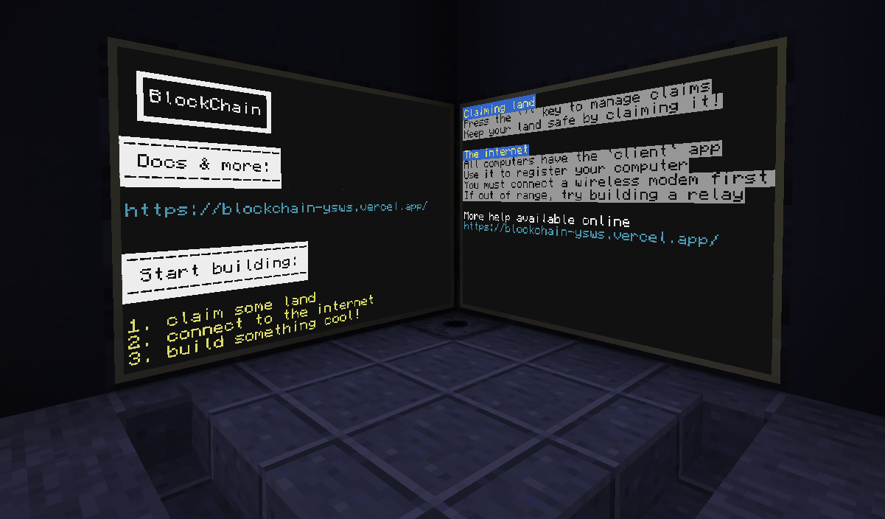
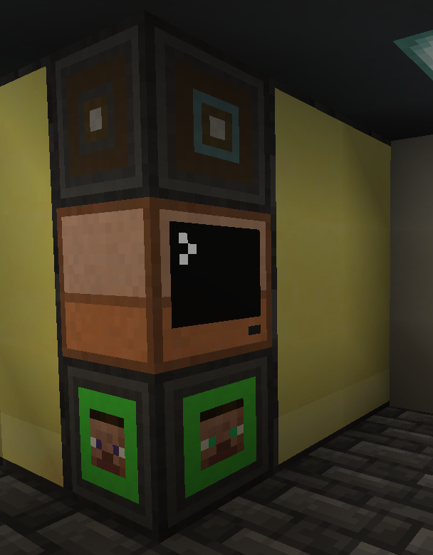
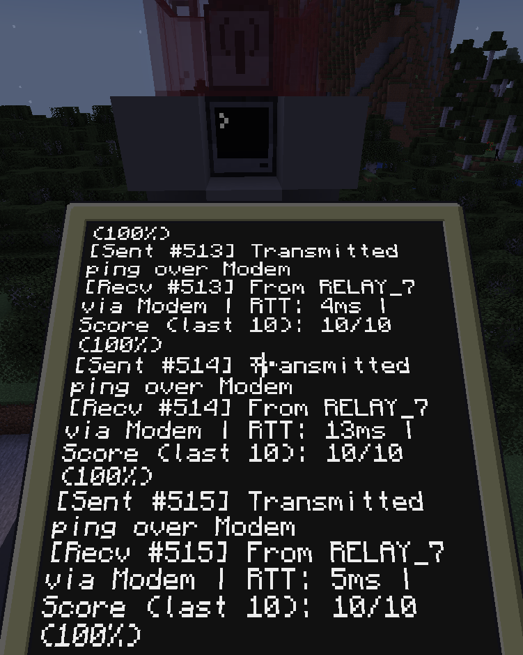
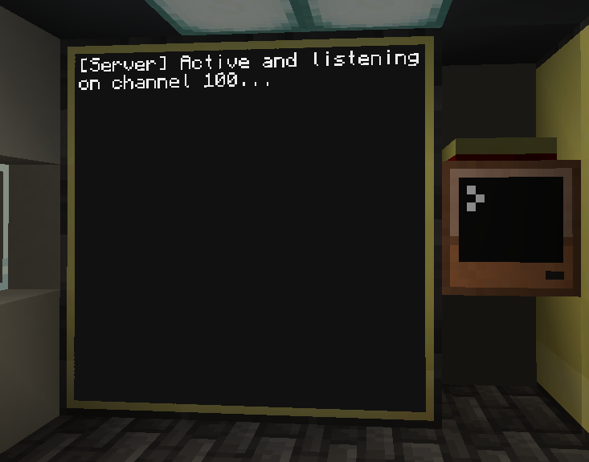

# BlockChain

Contrary to the title, BlockChain has little to do with cryptocurrency. It is a Minecraft YSWS (you ship, we ship).

## YSWS

A YSWS (or you ship, we ship) is a program rewarding teens who "ship" software. Check out [HackClub](https://hackclub.com/)!

## What is it?

BlockChain is split up into two main parts: ComputerCraft: Tweaked scripts, and a website and API.

It serves as a bridge between in-game networking infrastructure and out-of-game software.

## Demo

A demo is available [here](https://blockchain-ysws.vercel.app/).

The server token is `abc123`. Go ahead and abuse it.

## ComputerCraft: Tweaked Scripts

The latest version of the scripts are available through a GitHub release. You'll need to setup a world with the mods to run them.

Running the scripts isn't too exciting: they're more like libraries, which need users to call them in their own projects.

All source for the CC:T scripts are in the `cc` directory.

## Screenshots

MOTD at spawn:

Displays various text from the API.

New player detection and MOTD computer:

The other side of the MOTD monitors. Also detects new players and gives them a starting computer.

Radio-modem relay:

This relays modem communications over radio, which can travel long distances. A pocket computer is testing the connection.

Main server:

This server handles all the client communications, such as getting the MOTD or issuing P2P credentials.

## Modpack

A modpack file was included which you can import into Modrinth. It has all the addon mods along with a few QOL mods.
